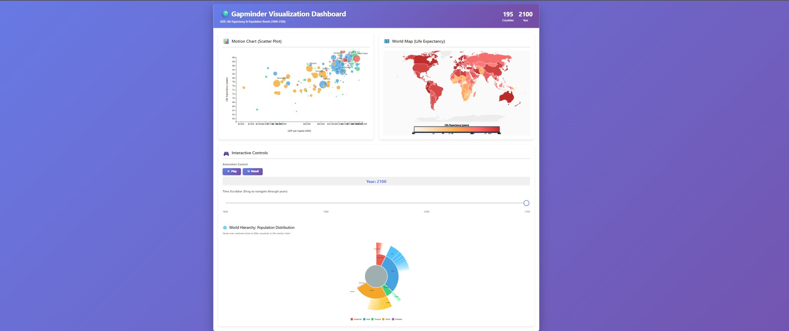
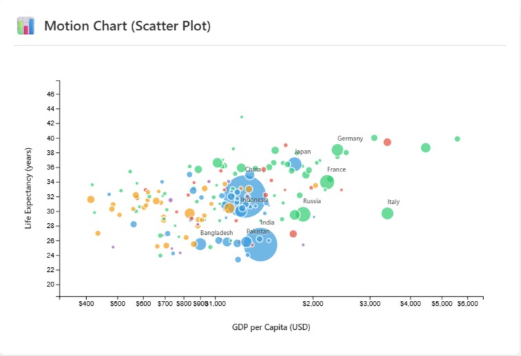
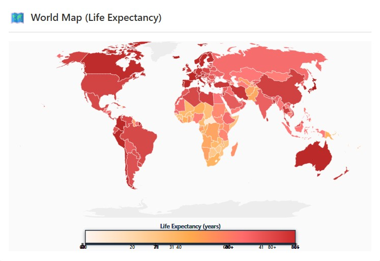
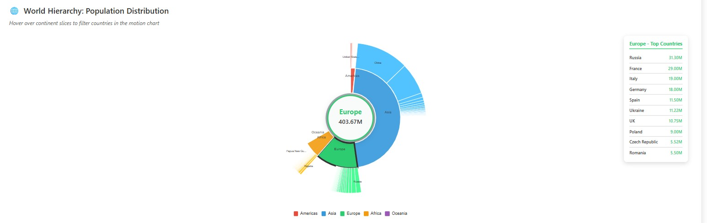
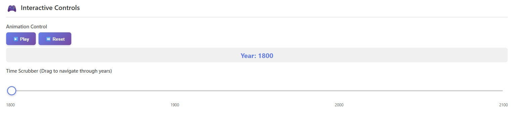

# Gapminder-D3-Dashboard

## Overview
Gapminder-D3-Dashboard is an interactive data visualization dashboard that brings together classic Gapminder-style storytelling with modern D3.js visual analytics. The project is designed to explore global development trends across time using coordinated views, including a motion chart, a world choropleth map, a hierarchical population view, and a custom time scrubber.

This repository emphasizes:
- Time-based exploration from 1800 to 2100
- Linked visualizations that react together
- A polished, presentation-ready dashboard layout
- Country-level insights across GDP, life expectancy, and population
- A custom-built interaction model using pure D3.js

## What this dashboard shows
The dashboard helps users understand how countries evolve over time by combining three core Gapminder dimensions:
- **GDP** for economic output
- **Life Expectancy** for health and development
- **Population** for scale and demographic changes

These are shown in multiple coordinated views so that users can compare trends globally, by continent, and by individual country.

## Main features
- **Motion chart / scatter plot**
  - Visualizes countries over time using the classic Gapminder bubble-chart concept.
  - Supports animated transitions through years.
  - Updates in sync with the timeline controls.

- **World choropleth map**
  - Displays life expectancy across countries on a geographic map.
  - Designed for global comparison and spatial pattern recognition.
  - Updates as the year changes.

- **Interactive controls**
  - Play / pause animation
  - Reset animation to the beginning
  - Custom draggable time slider
  - Hidden native range slider kept in sync for accessibility and state consistency

- **Hierarchical population view**
  - Uses a sunburst-style hierarchy to show population distribution.
  - Hover interactions can be used to filter or focus the motion chart by continent.

- **Linked visualization behavior**
  - All components are connected through shared state.
  - When the year changes, each chart updates together.
  - The controls panel drives the entire dashboard experience.

## Repository structure

### `html/`
Contains the main page template and dashboard layout.

- `html/index.html` builds the dashboard shell
- Loads D3.js and TopoJSON dependencies
- Defines the containers for the motion chart, choropleth map, controls, and hierarchy view
- Provides the styling for the complete interface

### `js/`
Contains the JavaScript modules that power the dashboard.

- `js/main.js` initializes the dashboard after the page loads
- `js/controls.js` handles play/pause, reset, and custom slider interactions
- `js/utils.js` manages shared state, data loading, continent mapping, map loading, and helper functions
- Additional visualization modules are loaded from the dashboard structure and are responsible for rendering the visual components and keeping them synchronized

### `data/`
Contains source and supporting data used by the project.

- `data/raw/` holds raw input files
- `data/processed/` holds transformed or derived data outputs
- The repository also includes data assets used by the dashboard workflow and preprocessing pipeline

### `script/`
Contains Python-based data preparation and transformation utilities.

- `script/fusion.py` is the data fusion / preparation script
- This script is used to combine and prepare the dataset used by the visualization layer

### `screenshots/`
Contains screenshots used to document the dashboard and explain the UI and interactions.

## How the app works
1. The page loads the dashboard structure from `html/index.html`.
2. JavaScript modules initialize each visualization container.
3. `js/utils.js` loads the merged dataset and world map.
4. `js/main.js` waits for the data to load, then updates all charts for the active year.
5. `js/controls.js` manages animation state and time navigation.
6. Every time the selected year changes, the motion chart, choropleth map, and hierarchy view update together.

## Data handling
The application loads a merged Gapminder dataset and normalizes it into fields such as:
- country
- geo
- year
- gdp
- lifeExp
- pop

The utility layer also maps countries to continents so the dashboard can support continent-based colors and filtering.

If a local world map file is unavailable, the project can fall back to an online world atlas source and convert it for visualization use.

## Interactions
- Drag the custom slider to jump to any year
- Click play to animate through time
- Click pause to stop the animation
- Click reset to return to the earliest year
- Hover hierarchy slices to explore continent-level population groupings
- Observe how all views update in sync as the selected year changes

## Screenshots
Below are the screenshots included in the repository, used to document each major part of the dashboard.

### Dashboard overview

This view shows the overall dashboard layout with the motion chart, choropleth map, controls, and hierarchy section arranged into a cohesive analysis workspace.

### Motion chart

This visualization presents the Gapminder-style animated scatter plot for comparing countries by GDP, life expectancy, and population.

### Synced choropleth map

This map view highlights geographic differences in life expectancy and updates together with the selected year.

### Interactive sunburst hierarchy

This hierarchy view shows population distribution by continent and helps filter or focus the motion chart.

### Custom slider

This screenshot shows the custom draggable time slider used to navigate the dashboard timeline.

### Motion chart playback

This demonstrates the animated behavior of the visualization when the time controls are active.

## Technical notes
- Built with **D3.js** and standard web technologies
- Uses modular JavaScript for clean separation of concerns
- Designed to support animated, coordinated multiview analysis
- Uses a custom control system rather than relying only on default HTML inputs
- Styled for a polished presentation with card-based layout and gradient UI accents

## Development highlights
- Shared global state keeps the dashboard synchronized
- The selected year is propagated to all visual components
- The custom slider is synchronized with the hidden native range input
- The visualization layout is responsive and designed for clarity
- The repository includes preprocessing logic to support the visualization pipeline

## Conclusion
Gapminder-D3-Dashboard is a fully interactive, storytelling-focused data visualization project for exploring long-term global development trends. It combines time navigation, geographic context, hierarchical structure, and animated comparison into a single dashboard experience.
